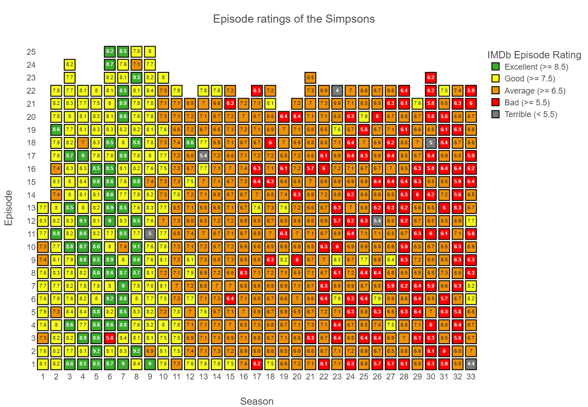

# Analysis of The Simpsons

## Webscraping

1) **IMDb Episode data**: Notebook 1 performs webscraping of IMDB to pull basic details of episodes of The Simpsons (`1. imdb_episode_scraper.ipynb`).

2) **Wikipedia Episode data**: This notebook pulls the high level data of episode data from Wikipedia; such as viewership numbers, directors and writers (`2. wiki_viewer_scraper.ipynb`).

3) **Wikipedia Guest-stars data**: This notebook pulls details of which guest stars appeared in each episode of The Simpsons from Wikipedia (`3. guest_star_scraper.ipynb`).

## Pre-processing

Some basic preprocessing of the data gathered from the first three notebookes is done in the notebook, `4. episode_preprocessing.ipynb`.

## Analysis

Visualizations and high-level analyis of the gathered data is then performed in `5. episode_analysis.ipynb`.

# Visualizations

## Episode Ratings

  

## US Viewership

  

  

